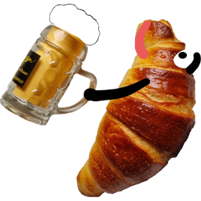

## Bemutatkozó
Sziasztok! Ádi vagyok. Szeretek 🚲biciklizni és 🍞sütögetni.

A kovásszal való sütés a legújabb hobbim. Nem, nem a pandémia alatt kezdtem ezzel foglalkozni, hanem már pár évvel előtte. Világ életemben rajongtam a frissen sült forró kenyérért, de csak ritkán jutottam hozzá, ezért egy nap kipróbáltam, hogy vajon tudok-e sütni. Nem lett túl jó, ezért megpróbáltam még1x, majd újra és újra, de egyik sem volt az igazi. Már féligmeddig elengedtem a dolgot, amikor kaptam kovászt egy kedves barátomtól... Majd a páromtól egy könyvet a kovászról... És hobbivá vált.

Szoftverfejlesztő vagyok. Anno az egyetemi tanulmányaim során algoritumos tervezés laboron a következő párbeszéd nagy hatással volt rám:
- `tanár` A kolléga mi alapján készíti a palacsintát?
- `hallgató` Recept alapján?!
- `tanár` NEM!!! Algoritmus alapján!

<!--truncate-->

## Az oldal célja
Az oldal leginkább saját használatra készül, amolyan sütési napló, jegyzetek, receptek próbálgatása, tapasztalatok rendszerezése egy mindenhonnan elérhető gyűjtőhelyre, jól kereshető, átlátható formában. Barátaim, ismerőseim, kollégáim sokszor kértek már tőlem receptet, tanácsot, kovászos témában. Ezeket próbálom most egy könnyeben elérhető platfromon rendszerezni.

Ajánlom mindenkinek az oldalt, aki imádja a frissen sült kovászos péktermékeket és szeretne belekóstolni a kovászos sütögetés élményébe és persze a végeredményébe.

Az itt található receptek alapja nem saját találmány, általában mindenféle sütögetős oldalakról, blogokról, fórumokról, illetve könyvekből van. Ezeket infós szemszögből értelmeztem újra, illetve a megszerzett rutin alapján finomítgattam. Meglátjuk mi sül ki belőle...🤓

## Csak a kovász
Igen, itt minden a kovász körül forog. Az élesztőt és sütőport felejtsd el!

A receptekhez idő kell, napok. Ha gyorsan szeretnél valami finomat sütni, akkor rossz helyen jársz. Ehhez a hobbihoz türelem kell. Kovászos tésztával dolgozni, nem csak edzés, hanem meditációs gyakorlat is egyben, amolyan szellemi és fizikai tréning. Különösen ajánlom azoknak, akik rettenetes időgazdálkodók. Ha ebbe belevágsz, tuit, hogy megtanulod beosztani az idődet és előre tervezni a heted.

A kovász egy élőlény, amolyan háziállat, a hűtőben lakik és csak hetente kér enni.

