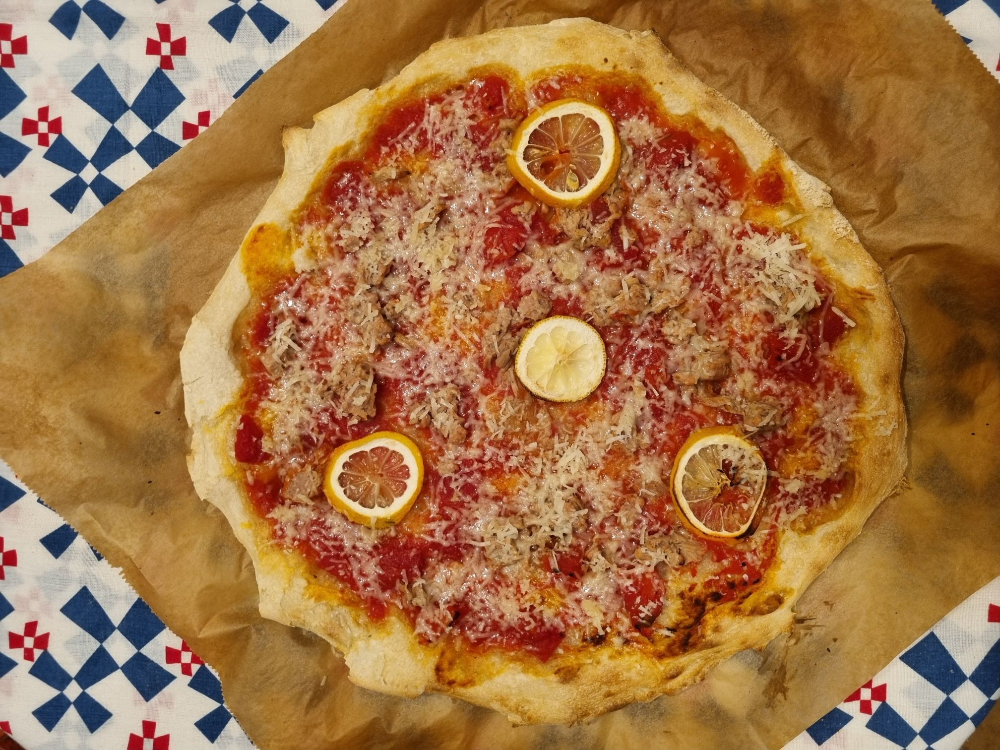
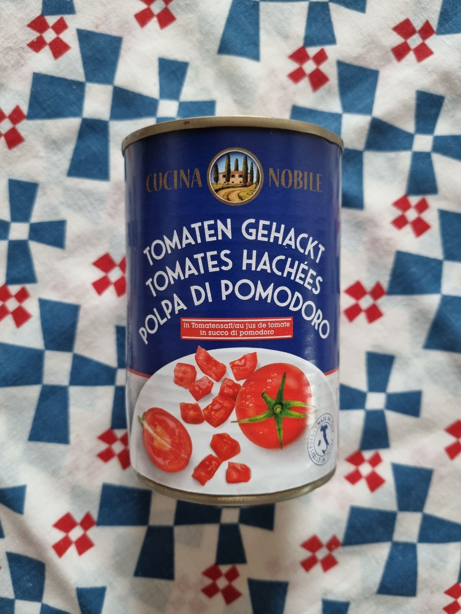

Sütöttem már ennél jobb pizzát, ez most egy erős közepes minőség lett. Kíváncsi voltam, milyen lesz, ha a bigát is 00-ás pizzalisztből csinálom. Na meg el akartam használni a régóta állott maradék pizzalisztem. Azonban a jól bevált recepttel sajnos túl vizes lett a tészta, alig bírtam kinyújtani, hozzáragadt mindenhez is. A gyengébb liszt miatt kevesebb vizet kellett volna hozzáadni, vagy több lisztet...

🔗[Képek a sütésről instán](https://www.instagram.com/p/CaaIJHYscTT/)

:::tip Mit tanultam
- Minden liszt más, a "jól bevált recept" csak a jól bevált liszttel működik
- Ne használj az előtésztához pizzalisztet, a legjobb a BL80
- Pizzaliszt nem vesz fel annyi vizet, mint a BL80, kevesebb víz kell hozzá
- Tepsit legalulra kell tenni, nem kell becsúsztatni a sínbe, csak letenni alulra, hogy közvetlenül érintkezzen a sütő falával
- 🌡️250°C-on alsó+felső grill+légkeverés, 🕗8 perc alatt megsül
:::

<!--truncate-->

## Részletek
Az alap szósz mindegyik pizzán az aldis Tomaten gehackt, azaz darabolt paradicsomkonzerv. Ez jött be a legjobban, egész nagy paradicsomkockák vannak benne.

### Feltétek
Mivel kb. semmi zöldség nem volt a hűtőben, pláne nem friss, így amit találtam az került rá.
Vega napot tartottunk, úgyhogy az alábbi húsmentes variációk születtek:

1. 🧄Pizza a la fokhagyma  
Bazsalikom, oregánó, fokhagyma meglocsolva egy kis olíva olajjal.
Ennyi.

1. 🧀Pizza a la kéksajt  
Szintén kapott a szósz egy kis oregánó, bazsalikom szórást, illetve találtam egy kis darab kéksajtot, az került rá kisebb nagyobb darabokban.

1. 🐟Pizza a la tonhal  
Csak 1 tonhalkonzerv és pár szelet citrom feltét. A végén mikor megsült még reszeltem rá egy kis parmezént, ami szépen ráolvadt a még forró pizzára.