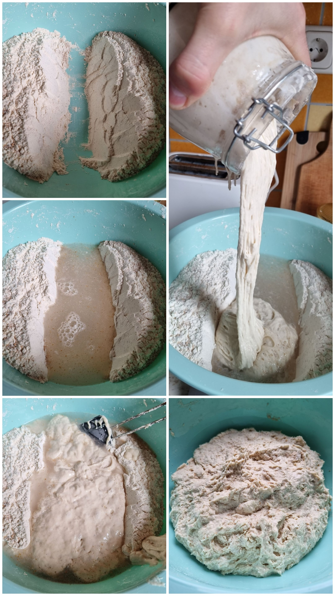

# 2/5)  Tészta összeállítása, autolízis
>⚒️ Nettó munka: ~10 perc  
>🕑 Pihi: 1-2 óra  

| liszt| víz|  kovász|  autolízis|
|:---:|:---:|:---:|---|
|750 g|450 g|500 g|🕑1-2 óra|

- Tégy egy tálba `750g lisztet`  
*mixelheted is, hogy 4/5 BL80 és 1/5 egyéb erősebb liszt pl. BL200 vagy BL112 stb. A lényeg, hogy legalább a 4/5-e BL80 legyen, mert kezdőknek a BL80 a tuti, azzal könnyű dolgozni és szinte lehetetlen elszúrni* 😄
- Adj hozzá `450g langyos vizet` ([Garat liszt](https://garatmalom.hu/) esetében 500 g)
- Végül öntsd hozzá a felhizlalt `500 g kovászt` és [keverd össze](https://www.instagram.com/p/Bve4fH3lHyE/), de csak épp annyira, hogy felszívja a vizet a liszt, és egy nagy masszává álljon össze, itt még nem dagasztunk!!! (lásd lenti fotón)
- Tedd félre 1-2 órára pihenni (fedett dagasztótálban)

:::tip Tippek az autolízishez
- Én szilikon lapáttal szoktam összekeverni a hozzávalókat nem kézzel, mert ilyenkor nagyon ragad minden.
- Sokan kovász hozzáadása nélkül csak a lisztet és a vizet keverik be, de egyszerűbb ha egyből hozzáadod a kovászt is, nincs különbség, így kevesebb vele a pepecselés.
- A lényeg, hogy az autolízis addig tart, amíg nem adsz hozzá sót. Ez a folyamat megáll, amint belekerül a só, szóval itt még szigorúan só nélkül!!!
:::
