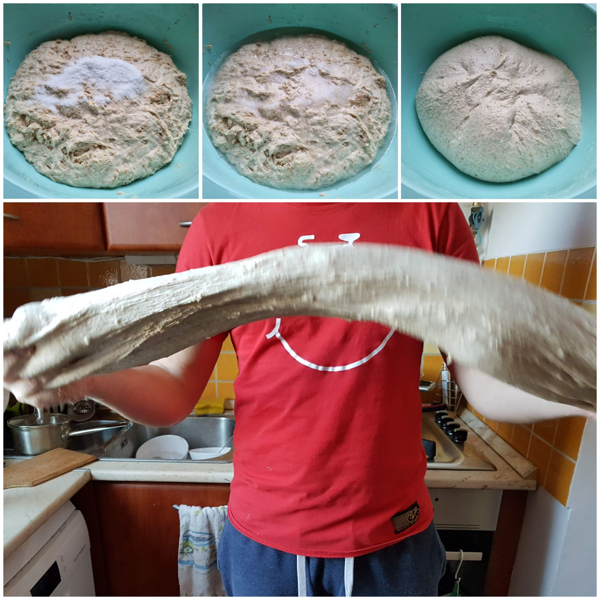

# 3/5)  Dagasztás és pihi
>⚒️ Nettó munka: 15-20 perc  
>🕑 Pihi: 2 óra

| só|  víz| dagasztás|
|:---:|:---:|:---:|
|20 g|~50g|🕒15 min|

- Szórj a tészta tetejére 20g sót (lehetőleg tengeri sót)
- Önts a sóra egy kis vizet, épp annyit, hogy feloldódjon a só
- Elkezdheted [dagasztani](https://www.instagram.com/p/BvQcmf6FzwN/)
- Ha kész vagy a dagasztással fedd le a dagasztótálat és hagyd pihenni 2 órát

:::tip Tippek a  dagasztáshoz
- Azért tengeri sót, mert a jódozott só megöli a bacikat!
- Ha úgy érzed nem elég lágy/nyúlós a tészta, nyugodtan adj még hozzá vizet és folyamatosan vizezd a kezed dagasztás közben, így kevésbé tapad rá a tészta.
- Lisztet ilyenkor már ne adj hozzá!
- Addig dagaszd, amíg jó nyúlós nem lesz, nem baj ha kicsit folyósabb, a lényeg, hogy nyúljon és ne szakadjon.
- Akkor jó a liszt/víz arány, ha épp elengedi a kezedet a tészta, hozzátapad, de lejön róla.
- A pihenés alatt fél óránként kicsit mozgasd át, hajtogasd meg
:::
