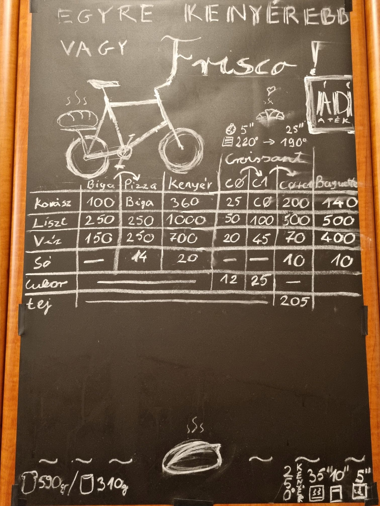

# Kovász mátrix
Az alábbi táblázatban minden érték grammban értendő!

||péktermék| | | | ||||
|---|---|---:|---:|---:|---:|---:|---:|---:|
|         |[kenyér](./baking-bread/ingredients)   |500   |750  |450|20|🚫|🚫|🚫 |
|            |kifli    |200   |475  |120|12|150 |30   |25 |
|   |baguette |140   |500  |400|10|🚫 |🚫   |🚫 |
|            |pizza    |biga  |250  |250|14|🚫 |🚫   |🚫 |
|                                                  |biga     |100   |250  |150|🚫|🚫 |🚫   |🚫 |
||croissant|croi1 |500  |70 |10|205|🚫   |~200|
|                                                  |croi1    |croi0 |100  |45 |🚫|🚫 |25   |🚫 |
|                                                  |croi0    |25    |50   |20 |🚫|🚫 |12   |🚫 |

## Az eredeti táblázat

